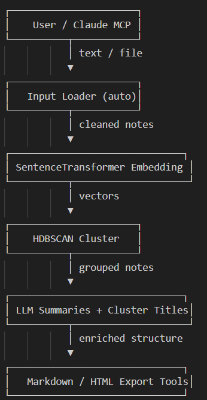

# 🚀 NeatNote — Turn Messy Notes Into Clear, Organized Insights
## ✨ AI-powered semantic clustering, summarization, and export engine — built with Claude MCP + Gradio

### NeatNote is an AI tool that transforms unstructured text into clean, structured knowledge using a combination of:

* Semantic embeddings (Sentence Transformers)
* Density-based clustering (HDBSCAN)
* LLM-based cluster titling + summarization
* Beautiful Markdown + HTML export
* Fully controllable through Claude via MCP tools

Whether you're collecting research notes, meeting minutes, chaotic brain dumps, or text files full of ideas — NeatNote organizes everything automatically into meaningful clusters with summaries to help you understand your information faster.

---

### 🔥 Why NeatNote?

Everyone has messy notes. **The problem is not collecting information, but making sense of it**.

NeatNote solves this by:

* Extracting the semantic meaning of your notes
* Grouping related ideas automatically
* Naming clusters intelligently with LLM summaries
* Exporting polished results
* Allowing full automation via Claude MCP for end-to-end workflows

This makes it perfect for:
* Students
* Researchers
* Founders
* Writers
* Productivity lovers
* Anyone with text chaos 🚀

---

### 🧭 Architecture Overview

Here's how it is structured:



---

### 📺 Demo Video

🎥 [Watch the Demo on YouTube](https://youtu.be/6d8Drbmn0-s?si=fk716CYMBnIpLKME)


---

### How to use it

* Edit the claude config file to add the below and save it.
```
{
  "mcpServers": {
    "gradio": {
      "command": "npx",
      "args": [
        "mcp-remote",
        "https://MCP-1st-Birthday-NeatNote.hf.space/gradio_api/mcp/sse"
      ]
    }
  }
}

```

* Once the MCP server is integrated into the Claude, then in the Claude UI enable the tools.
* Attach the notes.txt file with some messy notes or enter some notes manually (i.e 
* **Example prompt to use on claude**: Convert the attached file messy notes into beautiful structured notes in Inconsolata font html file.

---


